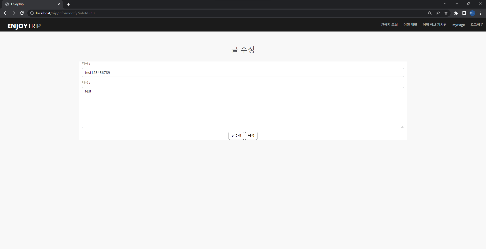

관통 프로젝트 제출 방법

# 관통프로젝트: 
### 프로젝트이름 : EnjoyTripSpring
### 제출일: 2023.05.02일 23시 59분

### 참여 페어
- 홍길동(조장), 임꺽정

### 처리된 요구사항 목록
  
|난이도|구현기능|세부|작성여부(O/X)|
|:---:|---|---|:---:|
|기본|메인페이지||O|
|기본|회원관리페이지|회원정보 등록화면|O|
|기본|회원관리페이지|회원정보 수정화면|O|
|기본|회원관리페이지|회원정보 삭제화면|O|
|기본|회원관리페이지|회원정보 검색화면|O|
|기본|로그인/로그아웃 페이지||O|
|기본|관광지 정보 관리 페이지|전체검색화면|O|
|기본|관광지 정보 관리 페이지|상세조회화면|O|
|기본|관광지 정보 관리 페이지|지역별 조회|O|
|기본|관광지 정보 관리 페이지|관광지 종류별 조회|O|
|추가||/사이트맵/메뉴구성|X|
|추가|나만의 여행 계획 관리 페이지||X|
|심화|HotPlace 관리  페이지||X|
|심화|게시판(여행정보 공유) 관리  페이지||O|

* 작성된 기능은 반드시 캡쳐되어야 합니다. 
* 추가로 구현한 기능을 표에 추가시키세요.

### 실행화면 캡쳐 - 
TODO: 요구사항 목록에서 완료 처리된 사항의 캡쳐 이미지를 등록하세요.

### 구현 기능 : 메인 페이지

  
### 구현 기능 : 회원관리 페이지  
  
   
- 회원가입  
  

- 로그인  
  

- 마이페이지  
  

### 구현 기능 : 관광지 정보 관리 페이지  
- 검색 조건에 맞게 관광지 조회  
  

### 구현 기능 : 게시판(여행정보 공유) 관리  페이지
  

- 페이징 처리  
  

- 정렬  
  
	[조회수 순으로 정렬]  
  

- 게시판 글 작성  
  
  

- 게시판 상세 보기  
(조회수 자동으로 증가)  
  

- 게시판 수정  
  

- 게시판 작성자 불일치시 수정&삭제 불가능  
  

- 게시판 검색 조건  

  
  

